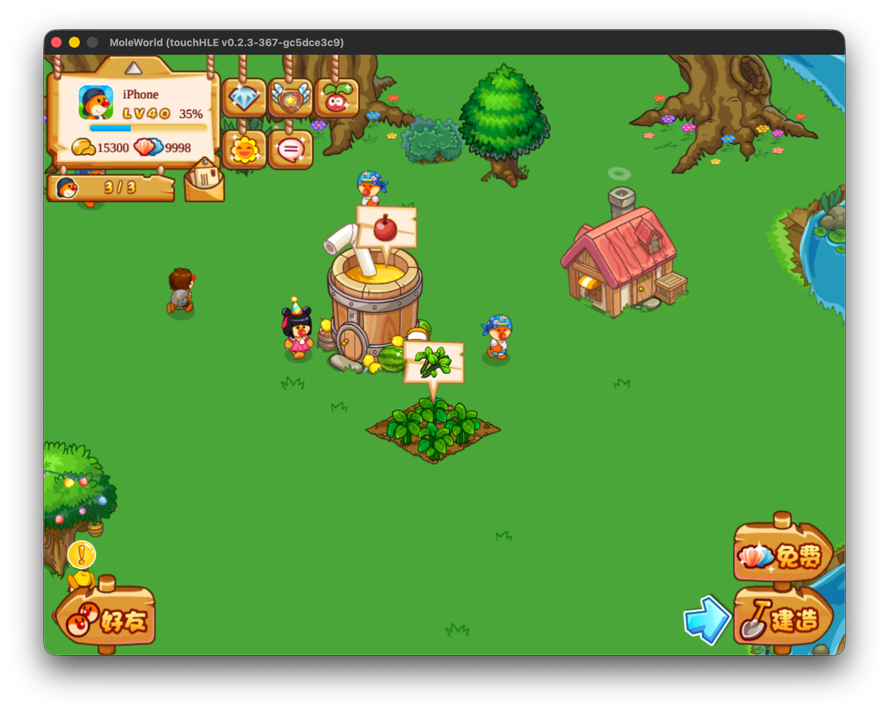

# 摩尔庄园HD 移动版 现代化离线移植（基于touchHLE）

[](https://github.com/moleworld-dev/MoleWorld-5.5.0-touchHLE-offline/releases)
[](https://github.com/moleworld-dev/MoleWorld-5.5.0-touchHLE-offline/stargazers)
[](#-下载与游玩)
[](https://touchhle.org)
[](LICENSE)



把 2015 年已停运下架的《摩尔庄园移动版》（安卓叫《摩尔庄园豪华版》，**2D 平面模拟经营**，非现在的 3D 新版）的最后一个版本 **5.5.0（夏季海洋更新）**，通过 [touchHLE](https://touchhle.org)（Rust 写的 iOS 高层模拟器）**搬到 macOS / Windows / Linux / Android / iOS 上离线游玩**。

> 💬 想一起玩、聊庄园、反馈问题?欢迎加入摩友交流群 **「摩尔庄园HD·庄园钉子户」**(群号 **578867042**):👉 [点击加入群聊](https://qm.qq.com/q/pLA75s9Vao)

> 这是一台 32 位 ARMv7 的 cocos2d-iphone 老游戏，官方服务器早已关停。本项目的目标是**不依赖任何服务器**，让游戏离线时的表现**和当年联网、服务器正常下发时一样**：能补全原版数据就补全，让原版逻辑自己跑，尽量不绕开原版流程、不白送东西。

---

## 🟢 离线能玩什么

- **主村经营**：种田收获、建造装饰、房间、商店、升级、主线 / 限时 / VIP 任务、每日任务、成就。
- **黄金岛（可建筑岛）完整复活**：默认岛与原版一致；商铺经营、餐厅升级、员工打工、咖啡馆许愿任务、超级贝壳树、探险船出海、岛仓库、岛日常与岛商店折扣、岛上 91 条任务链与岛成就，进出岛与退出时都会落盘。
- **活动中心（本机回环服务器）**：把原本由服务器下发的数据在本机按原协议应答，复活了**活动中心、每日签到（踩脚印）、脚印兑换、海底寻宝、系统公告、限时折扣、春节烟花、VIP 信息、占卜屋**等。
- **好友入口**：可进特色庄园逛丝尔特庄园，主线「看看外面的世界!」与每日「拜访 1 个推荐好友」离线可完成。
- **主村小游戏**：切水果、拍虫子、挖矿石、敲木桩、钓鱼；黄金岛沙滩 WC 的「左左右右」。
- **宽屏适配**：可铺满任意比例屏幕（视野横向扩展、UI 自动居中），也可锁定原版 4:3。
- **存档安全**：原子写盘、坏档隔离、主档自动保留上一代好档并在坏档时换回；同一存档只允许开一个游戏；切后台、关窗、关终端、注销关机前都会先存档。
- **内置修改器（按 T）**：数值、召唤、开关（解除购买门槛、冷却归零、建筑瞬完成、强制 VIP 等）、开发工具页（时间旅行、任务跳转、按经验值重算等级等）。修改器只改本地单机数据。

## 🔴 离线仍受限

- **离不开真实服务器的玩法**：好友互动与真人串门（推荐 / 访客格）、排行榜、米币、真实内购。离线会给原版的「需要联网」类提示，不会卡死、不丢数据。
- **其余季节联网活动**（爱丽丝、史莱克、火焰之战等）的美术当年是运行时从服务器下载的，本地不存在，离线多为空壳。
- 以下内容原版只在服务器上，**为移植者自拟、非原版数据**（代码与游戏内均已标明）：活动中心的本地活动表、脚印兑换表、限时折扣选品、系统公告正文、VIP 升级门槛、占卜屋奖池、离线每日任务选题规则。

---

## 📦 下载与游玩

发布包在 GitHub Releases 页：<https://github.com/moleworld-dev/MoleWorld-5.5.0-touchHLE-offline/releases>。四个桌面 / 安卓平台都已**内置游戏、开箱即玩**，无需自己找 IPA、无需登录。

- **🍎 macOS（Apple Silicon）**：下载 `.zip` → 解压 → **右键**「摩尔庄园.app」→「打开」（第一次需这样通过 Gatekeeper，之后双击即可）。
- **🪟 Windows x64**：下载 `.zip` → 解压 → 双击 **`Run-MoleWorld.bat`**。游戏窗口直接打开，不再带黑色控制台窗口。
- **🐧 Linux x64**：下载 `.tar.gz` → 解压 → 进文件夹双击 **`启动游戏.sh`**（GNOME 需右键 →「以程序运行」），或在终端里 `./启动游戏.sh`。想要应用菜单图标就运行同目录的 **`安装到应用菜单.sh`**；详见包内 **`如何运行.txt`**。需要系统装有 OpenGL / SDL2 运行库。
- **🤖 Android arm64**：下载 `.apk` → 安装（需允许「安装未知应用」）→ 直接进游戏。
- **📱 iOS（arm64）**：基于纯 Rust 解释器后端（无需 JIT），通过 TestFlight 分发测试，不在 Releases 页提供下载；代码在 `feat/ios-interpreter` 分支。

所有平台进游戏后按 **T** 键召出修改器菜单。存档保存在本机，换平台不互通。

### 🔧 从源码构建（可选）

1. 进 `fresh-port/20-touchHLE-src/touchHLE/`，执行 `cargo build --release`（vendor 依赖已摊平为普通文件，无需初始化子模块；boost 由构建脚本自动下载）。
2. macOS 上双击 `launchers/` 里的启动脚本即可运行；也可手动执行
   `./target/release/touchHLE "<仓库>/fresh-port/01-cracked/Payload/MoleWorld.app" --landscape-right --device-family=ipad`。
3. 启动脚本一览（都在 `launchers/`）：

| 脚本 | 用途 |
|---|---|
| `启动摩尔庄园.command` | 标准启动（iPad 横屏） |
| `启动摩尔庄园-宽屏.command` | 铺满屏幕、视野横向扩展 |
| `启动摩尔庄园-锁定比例.command` | 锁定原版 4:3 比例 |
| `启动摩尔庄园-iPhone版.command` | 以 iPhone 机型运行 |
| `启动摩尔庄园-在线服务器.command` | 开发用：连接私服的联网模式 |
| `启动摩尔庄园-账号菜单测试.command` | 开发用：原版账号菜单调试 |

> 四个平台的发布包由 CI（`.github/workflows/build-release.yml`）在推送 `v*` 标签时自动构建并挂到 Release。可调的环境变量与选项见 `fresh-port/20-touchHLE-src/touchHLE/OPTIONS_HELP.txt`。

---

## 📁 仓库结构

```
.
├─ README.md / NOTICE.md / LICENSE        # 说明 / 版权 / MPL-2.0
├─ .github/workflows/build-release.yml    # 四平台发版 CI(推 v* 标签触发)
├─ launchers/                             # macOS 源码运行用的启动脚本(需先 cargo build)
├─ docs/
│  ├─ releases/                           # 各版本发版说明
│  ├─ images/                             # README 配图与原版截图
│  └─ archive/                            # 早期研究报告与过时文档(仅存档,不再维护)
└─ fresh-port/
   ├─ 01-cracked/Payload/MoleWorld.app    # 游戏本体(原版 5.5.0 + 离线补的音乐/成就图),发版时内置进包
   └─ 20-touchHLE-src/touchHLE/           # touchHLE 源码 + 本项目全部改动
```

> 本项目的主要改动在 `fresh-port/20-touchHLE-src/touchHLE/src/`：`mole_cheats.rs`（钩子总调度、黄金岛离线、修改器开关）、`mole_activity.rs`（本机回环服务器）、`mole_items.rs`（物品、VIP、充值）、`mole_menu.rs`（T 键菜单）、`mole_dev.rs`（开发工具）、`mole_savebak.rs`（主档备份）、`save_reset.rs`，以及对 `objc/`、`frameworks/` 下各框架实现的补丁。

---

## 🔬 用了什么工具

- **[touchHLE](https://touchhle.org)** — 本项目的运行基座（Rust iOS 高层模拟器），本仓库是带摩尔庄园移植改动的 fork，已同步到上游 v0.3.0。
- **otool / nm / lipo / IDA** — 反汇编、ObjC 元数据导出；所有修复都以原版二进制的反汇编为依据。
- **openssl / plutil / Python** — 解密与解析游戏数据表（**AES-128-ECB**，全版本通用 key = ASCII `39653543fa0d66aa`）。
- **cycript + Mach API**（历史，真机脱壳）— 老越狱设备上 `task_for_pid`+`vm_read_overwrite` 自进程脱壳。
- **自建无头验证 harness** — 脚本驱动游戏 + 触摸注入 + 帧截图 + 坏档注入，每次修复都配回归测试。
- **旧版对比研究** — 1.1.5 / 2.4.3 / 5.4.0 / 5.5.0 四版差异分析（报告存档在 `docs/archive/oldver-reports/`）。

---

## 🙏 致谢

本项目站在前人肩膀上，特别感谢：

- **哔哩哔哩 [@萌新迎风听雨](https://space.bilibili.com/411256864)** —— 提供安装包与思路。相关帖子：<https://www.bilibili.com/opus/1118433441251065897>
- **Never.** 的教程《记一次在老 iOS 设备上折腾"摩尔庄园移动版/豪华版（2015）"的经历》—— <https://dreamiao.com/2229/>（游戏身份/版本史/超级贝壳内购破解/存档与语言 bug 等背景知识）
- **[touchHLE](https://touchhle.org)** 项目及其作者 —— 没有这个 iOS 模拟器,这一切都无从谈起。
- 淘米《摩尔庄园》原作团队 —— 童年回忆。
- **GitHub [@Ross74U](https://github.com/Ross74U)** —— Arch Linux 平台测试 + debug 编译支持,帮这个移植在更多 Linux 环境上跑起来。
- **哔哩哔哩 [@叔权](https://space.bilibili.com/21312192)** —— 在哔哩哔哩、小红书的早期宣发,以及镜像打包支持,让更多摩友找到回家的路。
- **社区支持** —— 平行摩尔(52 摩尔)、小小摩尔、摩尔新桃源社区,谢谢一路同行的摩友们。

---

## 🧧 赞赏榜 · 感谢打赏

这是一个纯爱发电、永久免费的怀旧项目。下面这些小摩尔自愿打赏,为爱发电添了一把柴 —— 这份心意我们一笔一笔都记下了,谢谢你们 ❤️

| 摩友 ID | 赞赏金额 |
| :--- | ---: |
| 2001太空漫遊🔴🔵(EdmundDHow) | ¥30 |
| 天堂雨 | ¥20 |
| 傲骨(残柔傲骨) | ¥20 |
| 秋生°(圆头耗子锄大地) | ¥3 |
| z | ¥50 |
| 欣欣然(呱呱) | ¥35 |
| 和 | ¥10 |
| 小锗12138 | ¥10 |
| vv²(草莓小熊软糖) | ¥100 |
| 般般 | ¥20 |
| 33(秋遥) | ¥30 |
| 小型贴图 | ¥20 |
| 潘多洛 | ¥30 |
| 鸽子 | ¥50 |
| 灵龍 | ¥15 |
| ^H^ | ¥10 |
| Rain | ¥30 |
| 麦门在逃薯条(池竹雪) | ¥10 |
| 白鱼肚 | ¥199 |
| 威风堂堂 de | ¥25 |
| GF 繁花 | ¥20 |
| 文火(PROBER) | ¥10 |
| 西伯利亚正红旗(是飞雪城中剑) | ¥30 |
| 往向孤独的晚灯 | ¥10 |
| The Au Lait(猫箱里没有猫) | ¥50 |

> 截至 v0.0.5 beta,共 **25 位**小摩尔赞赏、合计 **¥837**。你们的支持是我持续开发的动力,后面的版本继续努力 💪

---

## ⚖️ 法律声明

- 本仓库的 **touchHLE 部分遵循其原始 MPL-2.0 许可**。
- 仓库内的**游戏 IPA / 资源版权归淘米（Taomee）所有**,仅用于个人怀旧、技术研究与存档,**不得用于任何商业用途**。游戏已于 2015 年停运下架、服务器关闭,无任何官方在售渠道。如版权方提出异议,将立即移除相关内容。
- 修改器/作弊功能仅用于**离线单机**,服务器已死,不涉及任何在线作弊。
